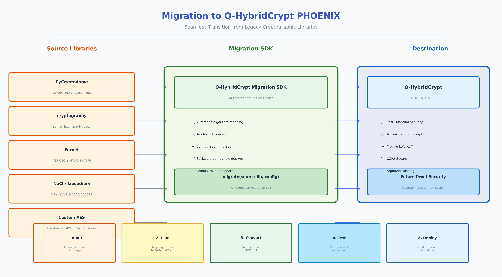
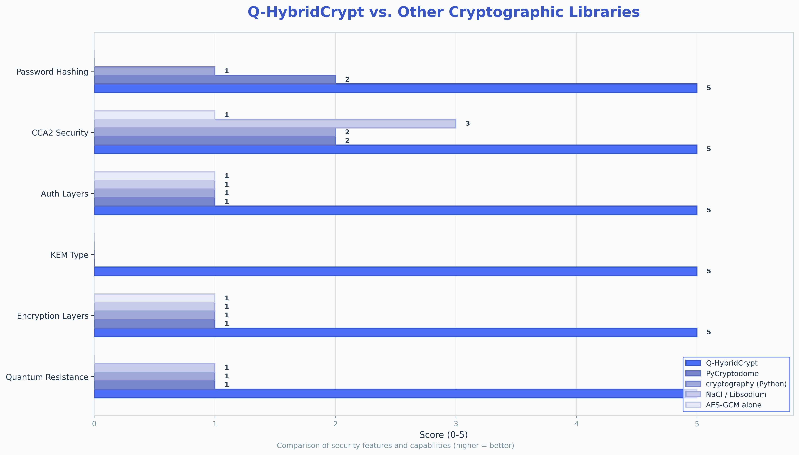

<div dir="rtl">

# Q-HybridCrypt v2.0 "PHOENIX" — راهنمای مهاجرت

## فهرست مطالب

1. [نمای کلی مهاجرت](#نمای-کلی-مهاجرت)
2. [فرآیند مهاجرت](#فرآیند-مهاجرت)
3. [مهاجرت از PyCryptodome](#مهاجرت-از-pycryptodome)
4. [مهاجرت از cryptography/Fernet](#مهاجرت-از-cryptographyfernet)
5. [مهاجرت از PyNaCl](#مهاجرت-از-pynacl)
6. [مهاجرت از AES-GCM سفارشی](#مهاجرت-از-aes-gcm-سفارشی)
7. [مهاجرت دسته‌ای](#مهاجرت-دسته‌ای)
8. [رمزنگاری مجدد شفاف](#رمزنگاری-مجدد-شفاف)
9. [بهترین شیوه‌ها و ملاحظات امنیتی](#بهترین-شیوه‌ها-و-ملاحظات-امنیتی)
10. [استراتژی‌های بازگشت](#استراتژی‌های-بازگشت)

---

## نمای کلی مهاجرت

مهاجرت از یک کتابخانه رمزنگاری موجود به Q-HybridCrypt v2.0 "PHOENIX" به‌عنوان یک فرآیند ساده و کم‌ریسک طراحی شده است. SDK مهاجرت کلاس‌های اختصاصی مهاجرت‌دهنده برای رایج‌ترین کتابخانه‌های رمزنگاری پایتون ارائه می‌دهد، همراه با تابع راحتی عمومی `migrate_from()` که با هر طرح رمزنگاری کار می‌کند. کل چارچوب مهاجرت بر اساس اصل **رمزنگاری مجدد شفاف** ساخته شده است: کد برنامه شما هرگز متن آشکار میانی را مدیریت نمی‌کند و منطق رمزگشایی قدیمی در یک تابع فراخوان (callback) منفرد کپسوله می‌شود که SDK به‌صورت داخلی فراخوانی می‌کند. این رویکرد تضمین می‌کند که حتی در حین فرآیند انتقال، ریسک افشای داده‌ها به حداقل برسد.

سفر مهاجرت معمولاً شامل سه مرحله اصلی است. اول، ارزیابی فهرست رمزنگاری فعلی خود، شناسایی کتابخانه‌ها و الگوریتم‌های مورد استفاده، مکان داده‌های رمزنگاری‌شده و کلیدهای درگیر. دوم، اجرای مهاجرت با استفاده از SDK، چه آیتم به آیتم و چه به‌صورت دسته‌ای، برای رمزنگاری مجدد تمام داده‌ها تحت پروتکل آبشاری سه‌لایه‌ای PHOENIX. سوم، تأیید اعتبار مهاجرت با رمزگشایی نمونه‌ای از داده‌های رمزنگاری‌شده جدید و مقایسه آن با متن آشکار اصلی، اطمینان از اینکه هیچ داده‌ای در حین انتقال گم یا خراب نشده است.



SDK مهاجرت Q-HybridCrypt از چهار کتابخانه منبع اولیه پشتیبانی می‌کند: PyCryptodome، بسته `cryptography` (شامل Fernet)، PyNaCl/NaCl و پیاده‌سازی‌های سفارشی AES-GCM. هر کلاس مهاجرت‌دهنده یک API ساده‌شده متناسب با قراردادها و قالب‌های داده کتابخانه منبع ارائه می‌دهد، در حالی که تابع عمومی `migrate_from()` یک نقطه ورود مستقل از کتابخانه فراهم می‌کند که تنها به یک تابع فراخوان رمزگشایی نیاز دارد. این انعطاف‌پذیری به این معناست که می‌توانید از تقریباً هر طرح رمزنگاری، از جمله پیاده‌سازی‌های اختصاصی یا خانگی، مهاجرت کنید بدون نوشتن کد یکپارچه‌سازی سفارشی.

---

## فرآیند مهاجرت

### گردش کار مهاجرت گام‌به‌گام

فرآیند مهاجرت یک دنباله خوش‌تعریف از مراحل را دنبال می‌کند که یکپارچگی داده و امنیت را در هر مرحله تضمین می‌کند. درک هر مرحله به شما کمک می‌کند مهاجرت خود را مؤثرانه برنامه‌ریزی کنید و از مشکلات رایجی که می‌توانند به از دست رفتن داده یا آسیب‌پذیری‌های امنیتی منجر شوند، جلوگیری کنید. هر مرحله با دقت طراحی شده تا ریسک را به حداقل برساند و همزمان قابلیت نظارت و تأیید را فراهم سازد.

1. **ارزیابی فهرست**: قبل از نوشتن هرگونه کد مهاجرت، باید تمام داده‌های رمزنگاری‌شده در سیستم خود را فهرست کنید. شناسایی اینکه کدام کتابخانه هر قطعه داده را رمزنگاری کرده، از چه کلیدهایی استفاده شده و هر دو متن رمزنگاری‌شده و کلیدها کجا ذخیره شده‌اند. این فهرست پایه برنامه مهاجرت شما را تشکیل می‌دهد و به تخمین تلاش لازم کمک می‌کند. توجه ویژه به داده‌هایی داشته باشید که ممکن است با لایه‌های متعدد یا با کلیدهایی که در طول زمان چرخش داشته‌اند، رمزنگاری شده باشند.

2. **استخراج کلید**: اطمینان حاصل کنید که به تمام کلیدهای رمزگشایی لازم برای قالب قدیمی دسترسی دارید. اگر کلیدها در یک سرویس مدیریت کلید (KMS)، ماژول امنیتی سخت‌افزاری (HSM) یا متغیرهای محیطی ذخیره شده‌اند، تأیید کنید که فرآیند مهاجرت می‌تواند به آنها دسترسی داشته باشد. رمزگشایی یک نمونه کوچک را قبل از تعهد به مهاجرت کامل آزمایش کنید، زیرا کشف یک کلید مفقودی در میانه مهاجرت می‌تواند کل فرآیند را متوقف کرده و داده‌های شما را در وضعیت ناسازگار رها کند.

3. **اجرای مهاجرت**: از کلاس مهاجرت‌دهنده مناسب یا تابع `migrate_from()` برای رمزنگاری مجدد هر آیتم داده استفاده کنید. SDK رمزگشایی قالب قدیمی و رمزنگاری مجدد تحت PHOENIX را به‌صورت داخلی مدیریت می‌کند، بنابراین کد برنامه شما هرگز متن آشکار را نمی‌بیند. هر فراخوان مهاجرت متن رمزنگاری‌شده جدید را همراه با کلید عمومی PHOENIX لازم برای عملیات رمزنگاری آینده برمی‌گرداند.

4. **تأیید اعتبار**: پس از مهاجرت، یک نمونه آماری معنادار از داده‌های مهاجرت‌یافته را با رمزگشایی با PHOENIX و مقایسه با متن آشکار اصلی تأیید کنید. اسکریپت‌های تأیید خودکار به‌شدت توصیه می‌شوند، به‌ویژه برای مجموعه‌داده‌های بزرگ که تأیید دستی در آنها غیرعملی است. در نظر بگیرید که یک چکسام (مثلاً SHA3-256) از متن آشکار اصلی برای اهداف مقایسه نگه دارید.

5. **چرخش کلید**: پس از تأیید مهاجرت، کلیدهای رمزنگاری قدیمی را با استفاده از یک روش تخریب گواهی‌شده به‌طور امن نابود کنید. کلیدهای خصوصی PHOENIX را در ذخیره‌سازی امن نگه دارید. تمام پیکربندی برنامه را به‌روز کنید تا به متون رمزنگاری‌شده و کلیدهای جدید اشاره کند و ارجاعات به کتابخانه رمزنگاری قدیمی را از پایگاه کد خود حذف کنید.

### معماری مهاجرت

```
┌──────────────────┐     ┌──────────────────┐     ┌──────────────────┐
│  متن رمزنگاری‌شده │────▶│   SDK مهاجرت     │────▶│  متن رمزنگاری‌شده │
│  قدیمی (هر قالب) │     │  (رمزنگاری مجدد   │     │  PHOENIX         │
│                   │     │   شفاف)           │     │  (قالب QHC2)     │
└──────────────────┘     └────────┬─────────┘     └──────────────────┘
                                  │
                         ┌────────┴─────────┐
                         │ تابع رمزگشایی    │
                         │ قدیمی (فراخوان    │
                         │ شما)              │
                         └──────────────────┘
```

SDK مهاجرت هرگز متن آشکار را بیش از حد لازم در حافظه ذخیره نمی‌کند. پس از تکمیل رمزنگاری مجدد، بافر متن آشکار آزاد شده و واجد شرایط جمع‌آوری زباله می‌شود. برای امنیت اضافی، می‌توانید از تابع ابزاری `zero_memory()` از `qhybridcrypt.utils` برای بازنویسی صریح بافرهای حساس قبل از خروج آنها از محدوده استفاده کنید. این تابع با صفر کردن تمام بایت‌های بافر حافظه، اطمینان حاصل می‌کند که حتی اگر حافظه بعداً توسط فرآیند دیگری خوانده شود، هیچ اطلاعات حساسی در آن وجود نخواهد داشت.

---

## مهاجرت از PyCryptodome

PyCryptodome یکی از پرکاربردترین کتابخانه‌های رمزنگاری در اکوسیستم پایتون است که طیف گسترده‌ای از الگوریتم‌ها شامل AES، RSA، ChaCha20 و توابع هش متعدد را ارائه می‌دهد. مهاجرت از PyCryptodome به Q-HybridCrypt ساده است زیرا کلاس `PyCryptodomeMigrator` یک تابع فراخوان رمزگشایی ساده را می‌پذیرد که منطق رمزگشایی موجود PyCryptodome شما را پوشش می‌دهد. این بدان معناست که نیازی به تغییر نحوه استفاده از PyCryptodome برای رمزگشایی ندارید؛ به‌سادگی تابع رمزگشایی را به مهاجرت‌دهنده منتقل کنید و خروجی رمزنگاری‌شده PHOENIX دریافت کنید.

رایج‌ترین الگوهای رمزنگاری PyCryptodome شامل AES-GCM، AES-CBC با پدینگ PKCS7 و RSA-OAEP هستند. هر یک از این الگوها به یک تابع فراخوان رمزگشایی کمی متفاوت نیاز دارد، اما خود فرآیند مهاجرت یکسان باقی می‌ماند. نکته کلیدی این است که مهاجرت‌دهنده اهمیتی نمی‌دهد که ساختار داخلی متن رمزنگاری‌شده قدیمی چگونه است؛ فقط تابعی نیاز دارد که بایت‌های متن رمزنگاری‌شده قدیمی را به بایت‌های متن آشکار تبدیل کند. این طراحی منطق مهاجرت را از طرح رمزنگاری خاص جدا می‌کند و آن را در برابر تنوعات پیکربندی PyCryptodome مقاوم می‌سازد.

### مهاجرت داده‌های AES-GCM

```python
from qhybridcrypt.migration import PyCryptodomeMigrator

# تنظیمات PyCryptodome AES-GCM موجود شما
from Crypto.Cipher import AES
from Crypto.Random import get_random_bytes

aes_key = get_random_bytes(32)  # کلید AES-256 موجود شما

# تابع رمزنگاری قدیمی (روش فعلی رمزنگاری شما)
def old_aes_gcm_encrypt(plaintext: bytes) -> bytes:
    cipher = AES.new(aes_key, AES.MODE_GCM)
    ciphertext, tag = cipher.encrypt_and_digest(plaintext)
    return cipher.nonce + tag + ciphertext  # nonce(16) + tag(16) + ciphertext

# تعریف تابع فراخوان رمزگشایی برای مهاجرت‌دهنده
def old_aes_gcm_decrypt(ciphertext_bytes: bytes) -> bytes:
    nonce = ciphertext_bytes[:16]
    tag = ciphertext_bytes[16:32]
    ct = ciphertext_bytes[32:]
    cipher = AES.new(aes_key, AES.MODE_GCM, nonce=nonce)
    return cipher.decrypt_and_verify(ct, tag)

# --- مهاجرت ---
migrator = PyCryptodomeMigrator(security_level=3)

# مهاجرت یک آیتم رمزنگاری‌شده منفرد
old_ciphertext = old_aes_gcm_encrypt(b"داده حساس رمزنگاری‌شده با PyCryptodome")
new_ciphertext, phoenix_public_key = migrator.migrate(
    old_ciphertext,
    old_aes_gcm_decrypt,
    associated_data=b"migration:pycryptodome->phoenix"
)

print(f"اندازه متن رمزنگاری‌شده قدیمی: {len(old_ciphertext)} بایت")
print(f"اندازه متن رمزنگاری‌شده PHOENIX جدید: {len(new_ciphertext)} بایت")
print(f"اندازه کلید عمومی PHOENIX: {len(phoenix_public_key)} بایت")

# تأیید مهاجرت با رمزگشایی با PHOENIX
from qhybridcrypt import QHybridCrypt
crypto = QHybridCrypt()
# باید کلید خصوصی بازگردانده‌شده در حین مهاجرت را به‌طور امن ذخیره کنید!
```

### مهاجرت داده‌های AES-CBC

```python
from qhybridcrypt.migration import PyCryptodomeMigrator
from Crypto.Cipher import AES
from Crypto.Util.Padding import unpad

aes_key = b'your-32-byte-aes-key-here-1234567890'  # کلید موجود شما

def old_aes_cbc_decrypt(ciphertext_bytes: bytes) -> bytes:
    iv = ciphertext_bytes[:16]
    ct = ciphertext_bytes[16:]
    cipher = AES.new(aes_key, AES.MODE_CBC, iv=iv)
    return unpad(cipher.decrypt(ct), AES.block_size)

migrator = PyCryptodomeMigrator()
old_ct = b'...'  # داده‌های رمزنگاری‌شده AES-CBC شما
new_ct, new_pk = migrator.migrate(old_ct, old_aes_cbc_decrypt)
```

### مهاجرت داده‌های رمزنگاری‌شده با RSA

```python
from qhybridcrypt.migration import PyCryptodomeMigrator
from Crypto.PublicKey import RSA
from Crypto.Cipher import PKCS1_OAEP

# بارگذاری کلید خصوصی RSA موجود شما
with open('private_key.pem', 'rb') as f:
    rsa_key = RSA.import_key(f.read())

def old_rsa_decrypt(ciphertext_bytes: bytes) -> bytes:
    cipher = PKCS1_OAEP.new(rsa_key)
    return cipher.decrypt(ciphertext_bytes)

migrator = PyCryptodomeMigrator(security_level=5)  # حداکثر امنیت برای جایگزینی RSA
new_ct, new_pk = migrator.migrate(old_rsa_ciphertext, old_rsa_decrypt)
```

**توجه مهم**: رمزنگاری RSA اندازه متن آشکار محدودی دارد (مثلاً ۱۹۰ بایت برای RSA-2048 با OAEP-SHA256). اگر برنامه شما از رمزنگاری ترکیبی RSA+AES استفاده می‌کند (RSA برای رمزنگاری کلید AES، سپس AES برای داده‌ها)، تابع فراخوان رمزگشایی شما باید منطق رمزگشایی ترکیبی کامل را به‌صورت داخلی مدیریت کند و متن آشکار نهایی را به مهاجرت‌دهنده برگرداند. این رویکرد تضمین می‌کند که مهاجرت‌دهنده مستقل از پیچیدگی طرح رمزنگاری اصلی کار می‌کند.

---

## مهاجرت از cryptography/Fernet

کتابخانه `cryptography` غنی‌ترین و به‌خوبی نگهداری‌شده کتابخانه رمزنگاری برای پایتون است. این کتابخانه هم پریمیتیوهای سطح‌پایین (AES-GCM، ChaCha20) و هم ساختارهای سطح‌بالا مانند Fernet را ارائه می‌دهد. کلاس `CryptographyIOMigrator` پشتیبانی اختصاصی از توکن‌های Fernet از طریق متد راحتی `migrate_fernet()` ارائه می‌دهد که رمزگشایی base64 و Fernet را به‌طور خودکار مدیریت می‌کند. برای سایر پریمیتیوهای کتابخانه `cryptography`، متد استاندارد `migrate()` با یک تابع فراخوان رمزگشایی سفارشی به‌طور یکپارچه کار می‌کند.

Fernet به‌ویژه محبوب است زیرا یک API رمزنگاری ساده و خودکفا ارائه می‌دهد که تولید کلید، مدیریت nonce و احراز هویت را در یک رابط `encrypt()`/`decrypt()` مدیریت می‌کند. با این حال، Fernet از AES-128-CBC با HMAC-SHA256 برای احراز هویت استفاده می‌کند که تنها امنیت ۱۲۸ بیتی ارائه می‌دهد — بسیار کمتر از امنیت ۱۹۲ بیتی کلاسیک و ۱۲۸ بیتی کوانتومی ارائه‌شده توسط PHOENIX. مهاجرت از Fernet به Q-HybridCrypt یک ارتقای امنیتی قابل‌توجه represents، به‌ویژه برای سازمان‌هایی که نگران تهدیدات پسا‌کوانتومی هستند.

### مهاجرت توکن‌های Fernet

```python
from qhybridcrypt.migration import CryptographyIOMigrator

# تنظیمات Fernet موجود شما
from cryptography.fernet import Fernet

fernet_key = Fernet.generate_key()
fernet = Fernet(fernet_key)

# رمزنگاری داده‌ها با Fernet (روش قدیمی)
old_token = fernet.encrypt(b"داده قبلاً با Fernet رمزنگاری شده")

# --- مهاجرت یک‌مرحله‌ای با migrate_fernet() ---
migrator = CryptographyIOMigrator(security_level=3)
new_ciphertext, phoenix_pk = migrator.migrate_fernet(
    old_token,
    fernet_key,  # کلید Fernet را مستقیماً منتقل کنید
    associated_data=b"migration:fernet->phoenix"
)

print(f"اندازه توکن Fernet: {len(old_token)} بایت")
print(f"اندازه متن رمزنگاری‌شده PHOENIX: {len(new_ciphertext)} بایت")
```

### مهاجرت AES-GCM از کتابخانه cryptography

```python
from qhybridcrypt.migration import CryptographyIOMigrator
from cryptography.hazmat.primitives.ciphers.aead import AESGCM

aes_key = AESGCM.generate_key(bit_length=256)
aesgcm = AESGCM(aes_key)
nonce = b'12-byte-nonce'

# رمزنگاری قدیمی
old_ct = aesgcm.encrypt(nonce, b"داده رمزنگاری‌شده با AES-GCM کتابخانه cryptography", None)

# تابع فراخوان رمزگشایی
def old_decrypt(ciphertext_bytes: bytes) -> bytes:
    # فرض: قالب nonce(12) + aes_gcm_ct
    n = ciphertext_bytes[:12]
    ct = ciphertext_bytes[12:]
    return aesgcm.decrypt(n, ct, None)

# مهاجرت
migrator = CryptographyIOMigrator()
combined_old = nonce + old_ct  # ترکیب برای مهاجرت‌دهنده
new_ct, new_pk = migrator.migrate(combined_old, old_decrypt)
```

### مهاجرت از ChaCha20-Poly1305 کتابخانه cryptography.io

```python
from qhybridcrypt.migration import CryptographyIOMigrator
from cryptography.hazmat.primitives.ciphers.aead import ChaCha20Poly1305

key = ChaCha20Poly1305.generate_key()
chacha = ChaCha20Poly1305(key)
nonce = b'12-byte-nc'

old_ct = chacha.encrypt(nonce, b"داده رمزنگاری‌شده با ChaCha20", None)

def old_chacha_decrypt(ct_bytes: bytes) -> bytes:
    n = ct_bytes[:12]
    ct = ct_bytes[12:]
    return chacha.decrypt(n, ct, None)

migrator = CryptographyIOMigrator()
new_ct, new_pk = migrator.migrate(nonce + old_ct, old_chacha_decrypt)
```

---

## مهاجرت از PyNaCl

PyNaCl اتصالاتی به کتابخانه NaCl (شبکه‌سازی و رمزنگاری) ارائه می‌دهد که پریمیتیوهای رمزنگاری دانیل برنشتاین شامل رمزنگاری احراز‌شده XSalsa20-Poly1305، تبادل کلید X25519 و امضاهای Ed25519 را پیاده‌سازی می‌کند. کلاس `NaClMigrator` به‌طور خاص برای مدیریت قالب متن رمزنگاری‌شده NaCl طراحی شده که شامل یک برچسب Poly1305 به طول ۱۶ بایت در ابتدای متن رمزنگاری‌شده است. فرآیند مهاجرت با سایر مهاجرت‌دهنده‌ها یکسان است: یک تابع فراخوان رمزگشایی که از کد رمزگشایی NaCl موجود شما استفاده می‌کند ارائه می‌دهید و مهاجرت‌دهنده خروجی رمزنگاری‌شده PHOENIX برمی‌گرداند.

`SecretBox` در NaCl از XSalsa20-Poly1305 استفاده می‌کند که امنیت کلید ۲۵۶ بیتی با nonce ۱۹۲ بیتی فراهم می‌کند. در حالی که XSalsa20-Poly1305 امن تلقی می‌شود، از نظر KEM مقاوم در برابر کوانتوم نیست — سازوکار تبادل کلید (X25519) در برابر الگوریتم Shor روی یک کامپیوتر کوانتومی آسیب‌پذیر است. با مهاجرت به Q-HybridCrypt، شما تبادل کلید X25519 آسیب‌پذیر در برابر کوانتوم را با یک KEM مبتنی بر Module-LWE جایگزین می‌کنید که در برابر هر دو تحلیل کلاسیک و کوانتومی مقاوم است و همزمان از مزیت رمزنگاری آبشاری سه‌لایه‌ای بهره‌مند می‌شوید.

### مهاجرت داده‌های SecretBox

```python
from qhybridcrypt.migration import NaClMigrator

# تنظیمات PyNaCl موجود شما
from nacl.secret import SecretBox
from nacl.utils import random

nacl_key = random(SecretBox.KEY_SIZE)  # 32 بایت
box = SecretBox(nacl_key)

# رمزنگاری قدیمی
old_ciphertext = box.encrypt(b"داده رمزنگاری‌شده با PyNaCl SecretBox")

# تابع فراخوان رمزگشایی
def nacl_decrypt(ct_bytes: bytes) -> bytes:
    return box.decrypt(ct_bytes)

# --- مهاجرت ---
migrator = NaClMigrator(security_level=3)
new_ciphertext, phoenix_pk = migrator.migrate(
    old_ciphertext,
    nacl_decrypt,
    associated_data=b"migration:nacl->phoenix"
)

print(f"اندازه متن رمزنگاری‌شده NaCl: {len(old_ciphertext)} بایت")
print(f"اندازه متن رمزنگاری‌شده PHOENIX: {len(new_ciphertext)} بایت")
```

### مهاجرت SealedBox (رمزنگاری با کلید عمومی)

```python
from qhybridcrypt.migration import NaClMigrator
from nacl.public import PrivateKey, SealedBox

# جفت‌کلید NaCl موجود شما
nacl_private_key = PrivateKey.generate()
nacl_public_key = nacl_private_key.public_key

sealed_box = SealedBox(nacl_private_key)

# رمزنگاری قدیمی
old_ct = SealedBox(nacl_public_key).encrypt(b"داده رمزنگاری‌شده با کلید عمومی")

# تابع فراخوان رمزگشایی
def nacl_sealed_decrypt(ct_bytes: bytes) -> bytes:
    return sealed_box.decrypt(ct_bytes)

# مهاجرت — جایگزینی X25519 آسیب‌پذیر با Module-LWE
migrator = NaClMigrator(security_level=3)
new_ct, new_pk = migrator.migrate(old_ct, nacl_sealed_decrypt)
```

---

## مهاجرت از AES-GCM سفارشی

بسیاری از برنامه‌ها پیاده‌سازی AES-GCM خود را دارند، اغلب با مدیریت nonce سفارشی، اشتقاق کلید یا قالب‌بندی متن رمزنگاری‌شده. کلاس `CustomAESMigrator` یک متد تخصصی `migrate_aes_gcm()` ارائه می‌دهد که مؤلفه‌های خام AES-GCM (nonce، متن رمزنگاری‌شده، برچسب و کلید) را به‌عنوان پارامترهای مجزا می‌پذیرد و رمزگشایی را به‌صورت داخلی با استفاده از کتابخانه `cryptography` یا PyCryptodome به‌عنوان پس‌زمینه مدیریت می‌کند. این کار نیاز به نوشتن تابع فراخوان رمزگشایی برای حالت رایجی که داده‌ها به‌سادگی با AES-GCM رمزنگاری شده‌اند را از بین می‌برد.

مهاجرت‌دهنده رایج‌ترین قالب‌های متن رمزنگاری‌شده AES-GCM را پشتیبانی می‌کند، از جمله nonce-prepend (nonce + ciphertext + tag)، tag-append (nonce + ciphertext + tag) و قالب‌های مؤلفه‌جداگانه که nonce، متن رمزنگاری‌شده و برچسب در مکان‌های مختلف ذخیره شده‌اند. با ارائه مؤلفه‌ها به‌صورت انفرادی، `migrate_aes_gcm()` می‌تواند هر یک از این قالب‌ها را بدون نیاز به الحاق آنها به یک رشته بایتی منفرد مدیریت کند. متد همچنین داده‌های مرتبط اختیاری (AAD) را می‌پذیرد که در رمزنگاری اصلی استفاده شده بود، که برای قالب‌هایی که AAD بخشی از احراز هویت است حیاتی است.

### استفاده از migrate_aes_gcm()

```python
from qhybridcrypt.migration import CustomAESMigrator

# مؤلفه‌های AES-GCM موجود شما
aes_key = b'0123456789abcdef0123456789abcdef'  # کلید ۳۲ بایتی
nonce = b'0123456789ab'                         # nonce ۱۲ بایتی
ciphertext = b'...'                             # متن رمزنگاری‌شده AES-GCM
tag = b'0123456789abcdef'                       # برچسب GCM ۱۶ بایتی

# --- مهاجرت ---
migrator = CustomAESMigrator(security_level=3)
new_ciphertext, phoenix_pk = migrator.migrate_aes_gcm(
    nonce=nonce,
    ciphertext=ciphertext,
    tag=tag,
    aes_key=aes_key,
    associated_data=b"optional_aad"
)

print(f"اندازه متن رمزنگاری‌شده PHOENIX جدید: {len(new_ciphertext)} بایت")
```

### مهاجرت قالب سفارشی با مؤلفه‌های جداگانه

```python
from qhybridcrypt.migration import CustomAESMigrator

# اگر قالب سفارشی شما مؤلفه‌ها را جداگانه ذخیره می‌کند
# (مثلاً nonce در یک ستون DB، متن رمزنگاری‌شده در ستون دیگر)
import base64

# بارگذاری مؤلفه‌ها از ذخیره‌گاه شما
nonce = base64.b64decode(stored_nonce_b64)
ciphertext = base64.b64decode(stored_ct_b64)
tag = base64.b64decode(stored_tag_b64)
aes_key = kms_get_key('my-aes-key-id')

migrator = CustomAESMigrator()
new_ct, pk = migrator.migrate_aes_gcm(
    nonce=nonce,
    ciphertext=ciphertext,
    tag=tag,
    aes_key=aes_key
)

# ذخیره new_ct و pk در پایگاه داده
store_phoenix_ciphertext(record_id, new_ct, pk)
```

### مهاجرت با تابع فراخوان رمزگشایی سفارشی

```python
from qhybridcrypt.migration import CustomAESMigrator

# برای پیاده‌سازی‌های واقعاً سفارشی (مثلاً پدینگ غیراستاندارد، اشتقاق کلید سفارشی)
def my_custom_decrypt(ct_bytes: bytes) -> bytes:
    # منطق رمزگشایی سفارشی شما در اینجا
    nonce = ct_bytes[:12]
    tag = ct_bytes[-16:]
    ct = ct_bytes[12:-16]
    # ... رمزگشایی سفارشی ...
    return plaintext

migrator = CustomAESMigrator()
new_ct, pk = migrator.migrate(old_ct_bytes, my_custom_decrypt)
```

---

## مهاجرت دسته‌ای

برای برنامه‌هایی با مجموعه‌داده‌های بزرگ — مانند پایگاه‌های داده حاوی هزاران یا میلیون‌ها رکورد رمزنگاری‌شده — SDK مهاجرت یک متد `batch_migrate()` ارائه می‌دهد که چندین متن رمزنگاری‌شده را به‌طور کارآمد در یک عملیات پردازش می‌کند. تمام آیتم‌های یک دسته به همان جفت‌کلید PHOENIX مهاجرت می‌کنند که سربار مدیریت کلید را کاهش می‌دهد و استقرار داده‌های مهاجرت‌یافته را ساده می‌سازد. مهاجرت دسته‌ای همچنین یک فراخوان پیشرفت پشتیبانی می‌کند که به شما امکان نظارت بر پیشرفت مهاجرت را به‌صورت بلادرنگ می‌دهد که برای مهاجرت‌های طولانی‌مدت مجموعه‌داده‌های بزرگ ضروری است.

مهاجرت دسته‌ای با تحمل خطا طراحی شده است. اگر هر آیتم منفردی نتواند مهاجرت کند (مثلاً زیرا تابع فراخوان رمزگشایی یک استثنا برای یک متن رمزنگاری‌شده خراب ایجاد می‌کند)، کل دسته با یک پیام خطای توصیفی لغو می‌شود که نشان می‌دهد کدام آیتم شکست خورده و چرا. این رویکرد «همه یا هیچ» یکپارچگی داده را تضمین می‌کند: یا تمام آیتم‌ها با موفقیت مهاجرت می‌کنند، یا هیچکدام، و از مهاجرت‌های جزئی که می‌توانند داده‌های شما را در وضعیت ناسازگار رها کنند جلوگیری می‌کند. برای مجموعه‌داده‌هایی که شکست آیتم‌های منفرد نباید کل مهاجرت را مسدود کند، می‌توانید منطق تلاش مجدد یا رد کردن را در تابع فراخوان رمزگشایی خود پیاده‌سازی کنید.

### مثال مهاجرت دسته‌ای

```python
from qhybridcrypt.migration import MigrationSDK

# فرض کنید ۱۰۰۰ رکورد رمزنگاری‌شده از یک سیستم قدیمی دارید
old_records = []  # لیست بایت‌ها، هر کدام یک متن رمزنگاری‌شده قالب قدیمی
for i in range(1000):
    old_records.append(old_encrypt(f"رکورد {i}".encode()))

# تعریف تابع رمزگشایی قدیمی
def old_decrypt(ct: bytes) -> bytes:
    # منطق رمزگشایی موجود شما
    return old_decrypt_impl(ct)

# --- مهاجرت دسته‌ای ---
sdk = MigrationSDK(security_level=3)

def progress_callback(current: int, total: int) -> None:
    pct = (current / total) * 100
    print(f"\rدر حال مهاجرت: {current}/{total} ({pct:.1f}%)", end='', flush=True)

new_ciphertexts, phoenix_pk = sdk.batch_migrate(
    old_ciphertexts=old_records,
    old_decrypt_fn=old_decrypt,
    associated_data=b"batch:migration:2024",
    on_progress=progress_callback
)

print(f"\nمهاجرت کامل شد! {len(new_ciphertexts)} رکورد مهاجرت یافت.")
print(f"کلید عمومی PHOENIX: {phoenix_pk.hex()[:32]}...")

# تأیید یک نمونه
from qhybridcrypt import QHybridCrypt
crypto = QHybridCrypt()
# رمزگشایی نیاز به کلید خصوصی دارد (به‌صورت داخلی در حین batch_migrate تولید شده)
# کلید خصوصی را به‌طور امن در کنار ارجاع کلید عمومی ذخیره کنید
```

### مهاجرت دسته‌ای با مدیریت خطا

```python
from qhybridcrypt.migration import MigrationSDK, MigrationError

sdk = MigrationSDK()

# برای مجموعه‌داده‌هایی که برخی رکوردها ممکن است خراب باشند، از مهاجرت انفرادی
# با مدیریت خطا به‌جای batch_migrate() استفاده کنید
successful = []
failed = []

for i, old_ct in enumerate(old_records):
    try:
        new_ct, pk = sdk.migrate_encrypted_data(old_ct, old_decrypt)
        successful.append((i, new_ct, pk))
    except MigrationError as e:
        failed.append((i, str(e)))
        print(f"رکورد {i} شکست خورد: {e}")

print(f"موفق: {len(successful)}، شکست‌خورده: {len(failed)}")
```

---

## رمزنگاری مجدد شفاف

ویژگی **رمزنگاری مجدد شفاف** قابلیت پرچم SDK مهاجرت Q-HybridCrypt است. این ویژگی یک مسیر مهاجرت یک‌مرحله‌ای فراهم می‌کند که متن رمزنگاری‌شده قالب قدیمی را می‌خواند و متن رمزنگاری‌شده قالب PHOENIX را بدون اینکه متن آشکار در کد برنامه شما نمایان شود، خروجی می‌دهد. این یک ویژگی امنیتی بحرانی است: زیرا رمزگشایی و رمزنگاری مجدد در داخل SDK انجام می‌شود، هیچ پنجره‌ای وجود ندارد که متن آشکار به‌عنوان یک متغیر در فضای حافظه برنامه شما وجود داشته باشد که بتواند از طریق لاگ، dump یا افشای تصادفی از طریق ردیابی استثنا فاش شود.

پیاده‌سازی رمزنگاری مجدد شفاف ساده اما قدرتمند است. متد `migrate_encrypted_data()` دو آرگومان اصلی می‌گیرد: بایت‌های متن رمزنگاری‌شده قدیمی و یک تابع فراخوان رمزگشایی. SDK تابع فراخوان را برای به‌دست آوردن متن آشکار فراخوانی می‌کند، بلافاصله آن را تحت پروتکل PHOENIX با یک کپسوله‌سازی KEM تازه رمزنگاری مجدد می‌کند و متن رمزنگاری‌شده جدید را همراه با کلید عمومی لازم برای عملیات رمزنگاری آینده برمی‌گرداند. متن آشکار تنها به‌عنوان یک متغیر موقت در محدوده داخلی SDK وجود دارد و به‌محض تکمیل رمزنگاری مجدد واجد شرایط جمع‌آوری زباله می‌شود.

### نحوه عملکرد رمزنگاری مجدد شفاف

```
┌─────────────────┐
│  متن رمزنگاری‌شده │
│  قدیمی (هر قالب) │
└────────┬────────┘
         │
         ▼
┌─────────────────────────────────────────────┐
│          داخلی SDK مهاجرت                    │
│                                              │
│  ۱. فراخوانی old_decrypt_fn(old_ciphertext) │
│     └──▶ plaintext (موقتی، در حافظه)        │
│                                              │
│  ۲. تولید جفت‌کلید PHOENIX جدید             │
│     └──▶ public_key, private_key             │
│                                              │
│  ۳. crypto.encrypt(plaintext, public_key)    │
│     └──▶ new_ciphertext                      │
│                                              │
│  ۴. آزادسازی plaintext از حافظه             │
│                                              │
└────────┬──────────────────────┬──────────────┘
         │                      │
         ▼                      ▼
┌─────────────────┐   ┌─────────────────┐
│  متن رمزنگاری‌شده │   │  کلید عمومی      │
│  جدید (قالب QHC2)│   │  (برای رمزنگاری  │
│                  │   │   آینده)          │
└─────────────────┘   └─────────────────┘
```

### استفاده از تابع راحتی

ساده‌ترین راه برای استفاده از رمزنگاری مجدد شفاف از طریق تابع راحتی `migrate_from()` است که تنها به نام کتابخانه منبع، متن رمزنگاری‌شده قدیمی و یک تابع فراخوان رمزگشایی نیاز دارد. این تابع به‌طور خودکار کلاس مهاجرت‌دهنده مناسب را انتخاب و کل مهاجرت را در یک فراخوان مدیریت می‌کند. این سادگی به‌خصوص برای تیم‌هایی ارزشمند است که می‌خواهند به‌سرعت داده‌های خود را ارتقا دهند بدون اینکه با پیچیدگی‌های داخلی SDK درگیر شوند.

```python
from qhybridcrypt.migration import migrate_from

# مهاجرت یک‌مرحله‌ای عمومی از هر کتابخانه‌ای
def my_decrypt(ct: bytes) -> bytes:
    # منطق رمزگشایی موجود شما — با هر کتابخانه‌ای کار می‌کند
    return plaintext_bytes

new_ct, pk = migrate_from(
    library='pycryptodome',  # یا 'cryptography'، 'nacl'، 'custom'، 'aes-gcm'
    old_ciphertext=old_encrypted_data,
    old_decrypt_fn=my_decrypt,
    security_level=3,
    associated_data=b"optional_context"
)

# new_ct اکنون با PHOENIX رمزنگاری شده؛ pk کلید عمومی برای رمزنگاری آینده است
```

---

## بهترین شیوه‌ها و ملاحظات امنیتی

### چک‌لیست پیش از مهاجرت

قبل از شروع یک مهاجرت، اطمینان حاصل کنید که هر یک از موارد زیر را بررسی کرده‌اید. عدم آمادگی کافی می‌تواند منجر به از دست رفتن داده، زمان خرابی طولانی یا آسیب‌پذیری‌های امنیتی در پنجره مهاجرت شود. این چک‌لیست حاصل تجربیات متعدد از پروژه‌های مهاجرت واقعی است و رعایت آن به‌طور جدی توصیه می‌شود.

1. **فهرست کامل داده‌ها**: هر مکانی که داده‌های رمزنگاری‌شده ذخیره شده را مستند کنید، از جمله پایگاه‌های داده، سیستم‌های فایل، پشتیبان‌گیری‌ها، کش‌ها و صف‌های پیام. داده‌های رمزنگاری‌شده‌ای که در مهاجرت گنجانده نمی‌شوند در قالب قدیمی باقی می‌مانند و به‌طور بالقوه یک بار نگهداری دوگانه رمزنگاری ایجاد می‌کنند. شناسایی تمام مکان‌های ذخیره‌سازی داده یک پیش‌نیاز حیاتی است و نبود آن می‌تواند منجر به ناسازگاری داده در بخش‌های مختلف سیستم شود.

2. **دسترسی‌پذیری کلید**: تأیید کنید که تمام کلیدهای رمزگشایی برای قالب قدیمی قابل دسترسی و عملیاتی هستند. رمزگشایی یک نمونه نماینده را قبل از شروع مهاجرت کامل آزمایش کنید. کلیدهایی که در HSMها یا سرویس‌های ابری KMS ذخیره شده‌اند ممکن است به مجوزهای دسترسی خاصی نیاز داشته باشند که باید از قبل پیکربندی شوند. همچنین اطمینان حاصل کنید که فرآیند مهاجرت مجوزهای لازم برای دسترسی به سرویس‌های مدیریت کلید را دارد.

3. **استراتژی پشتیبان‌گیری**: قبل از شروع مهاجرت، پشتیبان‌گیری‌های تأییدشده از تمام داده‌های رمزنگاری‌شده و کلیدهای رمزگشایی ایجاد کنید. این پشتیبان‌گیری‌ها به‌عنوان تور ایمنی شما در صورتی که مهاجرت با مشکلات غیرمنتظره مواجه شود یا خروجی خراب تولید کند عمل می‌کنند. پشتیبان‌گیری باید در مکانی امن و جداگانه از محیط تولید ذخیره شود و قابلیت بازیابی آن قبل از شروع مهاجرت آزمایش شود.

4. **طرح بازگشت**: یک رویه بازگشت واضح تعریف کنید که به شما امکان برگشت به قالب رمزنگاری قدیمی را در صورت شکست مهاجرت یا نتایج غیرمنتظره می‌دهد. برای راهنمایی دقیق به بخش [استراتژی‌های بازگشت](#استراتژی‌های-بازگشت) مراجعه کنید. طرح بازگشت باید شامل مراحل مشخص، مسئولیت‌های تعریف‌شده و معیارهای تصمیم‌گیری برای فعال‌سازی بازگشت باشد.

5. **پنجره زمان خرابی**: یک پنجره نگهداری برنامه‌ریزی کنید که در آن داده‌های در حال مهاجرت به‌طور فعال خوانده یا نوشته نمی‌شوند. اصلاحات همزمان در حین مهاجرت می‌توانند منجر به ناسازگاری یا از دست رفتن داده شوند. مدت زمان پنجره باید بر اساس حجم داده و سرعت مهاجرت تخمین زده شود و حاشیه امنی برای مشکلات غیرمنتظره در نظر گرفته شود.

### ملاحظات امنیتی در حین مهاجرت

- **ذخیره‌سازی کلید**: کلیدهای خصوصی PHOENIX تولیدشده در حین مهاجرت باید با همان سطح یا سطح بالاتری از حفاظت نسبت به کلیدهای اصلی ذخیره شوند. استفاده از یک ماژول امنیتی سخت‌افزاری (HSM) یا یک KMS ابری برای ذخیره‌سازی کلید تولیدی را در نظر بگیرید. هرگز کلیدهای خصوصی را در کد منبع، فایل‌های پیکربندی در کنترل نسخه یا متغیرهای محیطی رمزنگاری‌نشده ذخیره نکنید. ذخیره‌سازی ناامن کلید خصوصی تمام مزایای امنیتی مهاجرت را بی‌اثر می‌کند.

- **مدیریت حافظه**: اگرچه SDK مهاجرت قرار دادن متن آشکار در معرض را به حداقل می‌رساند، جمع‌آورنده زباله پایتون صفر کردن فوری حافظه را تضمین نمی‌کند. برای برنامه‌هایی که با داده‌های بسیار حساس کار می‌کنند، استفاده از تابع ابزاری `zero_memory()` از `qhybridcrypt.utils` برای بازنویسی صریح بافرهای بایت‌آرایه حساس قبل از خروج آنها از محدوده را در نظر بگیرید. این اقدام احتیاطی اضافی اطمینان حاصل می‌کند که حتی در صورت بررسی حافظه توسط فرآیند مخرب، داده‌های حساسی یافت نخواهد شد.

- **ثبت لاگ مهاجرت**: SDK یک لاگ مهاجرت داخلی را نگه می‌دارد که هش هر متن رمزنگاری‌شده قدیمی، هش کلید عمومی جدید و وضعیت مهاجرت را ثبت می‌کند. از این لاگ از طریق `sdk.get_migration_log()` برای اهداف حسابرسی استفاده کنید. آگاه باشید که این لاگ حاوی هش‌های رمزنگاری متون رمزنگاری‌شده است که می‌تواند برای یک مهاجم مفید باشد اگر به خطر بیفتد — لاگ را مطابق محافظت کنید. لاگ مهاجرت یک ابزار ارزشمند برای ردیابی و تأیید فرآیند مهاجرت است اما خود نیز نیاز به محافظت امنیتی دارد.

- **سازگاری داده‌های مرتبط**: هنگام مهاجرت با داده‌های مرتبط (AAD)، اطمینان حاصل کنید که AAD استفاده‌شده در حین مهاجرت با AAD که در حین رمزگشایی استفاده خواهد شد مطابقت دارد. عدم تطابق AAD باعث شکست رمزگشایی می‌شود، حتی با کلید خصوصی صحیح. یک شیوه خوب این است که یک مهر زمانی مهاجرت و شناسه کتابخانه منبع را در AAD قرار دهید تا زمینه‌ای برای عملیات رمزگشایی آینده فراهم شود. این مستندسازی از سردرگمی‌های بعدی جلوگیری می‌کند و ردیابی منشأ داده‌های رمزنگاری‌شده را آسان‌تر می‌کند.

- **جدول زمانی تهدید کوانتومی**: در حالی که کامپیوترهای کوانتومی فعلی نمی‌توانند RSA، ECC یا رمزنگاری متقارن را بشکنند، تهدید «اکنون ذخیره کن، بعداً رمزگشایی کن» واقعی است. مهاجمان ممکن است امروز در حال جمع‌آوری داده‌های رمزنگاری‌شده با قصد رمزگشایی آنها پس از در دسترس قرار گرفتن کامپیوترهای کوانتومی باشند. مهاجرت به Q-HybridCrypt در اسرع وقت تضمین می‌کند که داده‌های رمزنگاری‌شده تحت پروتکل PHOENIX حتی در برابر مهاجمان کوانتومی آینده نیز امن باقی می‌مانند. هر روز تأخیر در مهاجرت، پنجره آسیب‌پذیری را گسترش می‌دهد.

### بهینه‌سازی عملکرد

- **پردازش دسته‌ای**: از `batch_migrate()` برای مجموعه‌داده‌های بزرگ به‌جای فراخوانی `migrate_encrypted_data()` در یک حلقه استفاده کنید. مهاجرت دسته‌ای یک جفت‌کلید منفرد برای تمام آیتم‌ها تولید می‌کند که سربار مدیریت کلید را کاهش و ذخیره‌سازی را ساده می‌کند. همچنین مهاجرت دسته‌ای بهینه‌سازی‌های داخلی دارد که از تولید مکرر جفت‌کلید جلوگیری می‌کند و عملکرد کلی را بهبود می‌بخشد.

- **امنیت پایین‌تر برای آزمایش**: در حین توسعه و آزمایش، از `security_level=1` برای تولید کلید و رمزنگاری سریع‌تر استفاده کنید. برای تولید به `security_level=3` (پیش‌فرض) یا `security_level=5` تغییر دهید. این رویکرد به شما امکان می‌دهد چرخه توسعه سریع‌تری داشته باشید بدون اینکه امنیت تولید را فدا کنید. توجه داشته باشید که داده‌های رمزنگاری‌شده با سطح امنیتی پایین‌تر نباید در محیط تولید استفاده شوند.

- **مهاجرت همزمان**: برای مجموعه‌داده‌های بسیار بزرگ، می‌توانید داده‌ها را پارتیشن‌بندی کرده و چندین فرآیند مهاجرت موازی اجرا کنید که هر کدام زیرمجموعه‌ای از رکوردها را پردازش می‌کنند. اطمینان حاصل کنید که هر پارتیشن از جفت‌کلید خود استفاده می‌کند تا جداسازی کلید حفظ شود. این رویکرد می‌تواند زمان مهاجرت را به‌طور قابل‌توجهی کاهش دهد، به‌ویژه روی سرورهای چند-هسته‌ای که منابع محاسباتی کافی در دسترس هستند.

---

## استراتژی‌های بازگشت

یک استراتژی بازگشت قوی برای هر پروژه مهاجرتی ضروری است. حتی با آزمایش کامل، مشکلات غیرمنتظره‌ای می‌تواند در مهاجرت‌های تولیدی ایجاد شود که نیاز به بازگشت به قالب رمزنگاری قدیمی دارند. SDK مهاجرت Q-HybridCrypt از طریق چندین سازوکار از بازگشت پشتیبانی می‌کند که هر کدام برای سناریوها و سطح تحمل ریسک متفاوتی مناسب هستند. انتخاب استراتژی بازگشت مناسب به عواملی مانند حجم داده، حساسیت داده و تحمل زمان خرابی بستگی دارد.

### استراتژی ۱: نوشتن دوگانه (توصیه‌شده برای تولید)

استراتژی نوشتن دوگانه همزمان متون رمزنگاری‌شده قالب قدیمی و جدید را در دوره مهاجرت نگه می‌دارد. کد برنامه از قالب جدید می‌خواند اما نوشتن به هر دو قالب را ادامه می‌دهد تا زمانی که مهاجرت به‌طور کامل تأیید شود. این رویکرد ایمن‌ترین مسیر بازگشت را فراهم می‌کند زیرا می‌توانید با تغییر مسیر خواندن فوراً به قالب قدیمی برگردید، بدون هیچ ریسک از دست رفتن داده. این استراتژی به‌خصوص برای سیستم‌های بحرانی مناسب است که هیچ تحملی برای از دست رفتن داده ندارند.

```python
# الگوی نوشتن دوگانه در حین مهاجرت
class DualWriteCrypto:
    def __init__(self, old_encrypt_fn, old_decrypt_fn, phoenix_crypto, phoenix_pk):
        self.old_encrypt = old_encrypt_fn
        self.old_decrypt = old_decrypt_fn
        self.phoenix = phoenix_crypto
        self.phoenix_pk = phoenix_pk
        self.use_phoenix = True  # تغییر برای بازگشت

    def encrypt(self, plaintext: bytes) -> dict:
        old_ct = self.old_encrypt(plaintext)
        new_ct = self.phoenix.encrypt(plaintext, self.phoenix_pk)
        return {'old': old_ct, 'new': new_ct}

    def decrypt(self, data: dict) -> bytes:
        if self.use_phoenix:
            return self.phoenix.decrypt(data['new'], self.phoenix_sk)
        else:
            return self.old_decrypt(data['old'])
```

### استراتژی ۲: نگهداری ارجاع کلید

متد `migrate_encrypted_data()` یک پارامتر `keep_old_key_ref` را پشتیبانی می‌کند که یک ارجاع هش به کلید رمزنگاری قدیمی ذخیره می‌کند. در حالی که این بازگشت مستقیم را امکان‌پذیر نمی‌کند (کلید قدیمی خود ذخیره نمی‌شود)، یک مسیر حسابرسی فراهم می‌کند که هر متن رمزنگاری‌شده PHOENIX را به رمزنگاری منبع آن متصل می‌کند. این برای اهداف انطباق و قانونی مفید است و در صورت نیاز به بررسی، امکان ردیابی منشأ هر داده رمزنگاری‌شده را فراهم می‌کند.

```python
sdk = MigrationSDK()

# نگهداری ارجاع به کلید قدیمی برای مسیر حسابرسی
new_ct, pk = sdk.migrate_encrypted_data(
    old_ciphertext,
    old_decrypt_fn,
    keep_old_key_ref=True  # ذخیره SHA3-256(old_ct[:64]) در لاگ مهاجرت
)

# مشاهده مسیر حسابرسی
log = sdk.get_migration_log()
for entry in log:
    print(f"وضعیت: {entry['status']}")
    print(f"هش قالب قدیمی: {entry['old_format_hash']}")
    print(f"ارجاع کلید قدیمی: {entry['old_key_ref']}")
    print(f"هش کلید جدید: {entry['new_key_hash']}")
```

### استراتژی ۳: پشتیبان‌گیری و بازیابی

ساده‌ترین استراتژی بازگشت، نگهداری پشتیبان‌گیری‌های کامل از داده‌های رمزنگاری‌شده قدیمی و کلیدهای رمزگشایی است. اگر مهاجرت نیاز به بازگشت داشته باشد، متون رمزنگاری‌شده قدیمی را از پشتیبان بازیابی و برنامه را برای استفاده از کتابخانه رمزنگاری قدیمی پیکربندی مجدد کنید. این رویکرد به فضای ذخیره‌سازی کافی برای پشتیبان‌گیری و یک رویه بازیابی آزمایش‌شده نیاز دارد. مزیت اصلی این استراتژی سادگی آن است و برای سیستم‌هایی با حجم داده متوسط مناسب است.

```python
# قبل از مهاجرت: ایجاد پشتیبان‌گیری تأییدشده
import shutil

def backup_before_migration(data_store_path, backup_path):
    shutil.copytree(data_store_path, backup_path)
    # تأیید یکپارچگی پشتیبان
    verify_backup_integrity(data_store_path, backup_path)

# پس از مهاجرت: اگر بازگشت لازم است
def rollback_to_old_format(backup_path, data_store_path):
    shutil.copytree(backup_path, data_store_path, dirs_exist_ok=True)
    # پیکربندی مجدد برنامه برای استفاده از کتابخانه رمزنگاری قدیمی
    update_config('encryption_library', 'old_library')
```

### استراتژی ۴: مهاجرت تدریجی با پرچم‌های ویژگی

برای استقرارهای بزرگ‌مقیاس، از پرچم‌های ویژگی برای کنترل قالب رمزنگاری مورد استفاده برای هر مؤلفه یا بخش کاربر استفاده کنید. این به شما امکان مهاجرت افزایشی، تأیید هر بخش به‌صورت مستقل و بازگشت بخش‌های منفرد بدون تأثیر بر کل سیستم را می‌دهد. این رویکرد به‌خصوص برای سازمان‌هایی با میلیون‌ها کاربر مفید است که مهاجرت یکباره برای آنها ریسک بالایی دارد و نیاز به کنترل دقیق بر فرآیند ارتقا دارند.

```python
# مهاجرت مبتنی بر پرچم ویژگی
import flags  # سیستم پرچم ویژگی شما

def get_crypto_for_user(user_id: str):
    if flags.is_enabled('phoenix_encryption', user_id):
        return phoenix_crypto, phoenix_pk
    else:
        return old_crypto, old_key

# مهاجرت کاربران یک بخش در هر زمان
for segment in user_segments:
    migrate_segment(segment)
    validate_segment(segment)
    flags.enable('phoenix_encryption', segment)
```

---

## مرجع سریع

| کلاس مهاجرت‌دهنده | کتابخانه منبع | متد کلیدی | راحتی |
|---|---|---|---|
| `PyCryptodomeMigrator` | PyCryptodome | `.migrate(ct, decrypt_fn)` | — |
| `CryptographyIOMigrator` | cryptography/Fernet | `.migrate(ct, decrypt_fn)` | `.migrate_fernet(token, key)` |
| `NaClMigrator` | PyNaCl/NaCl | `.migrate(ct, decrypt_fn)` | — |
| `CustomAESMigrator` | AES-GCM سفارشی | `.migrate(ct, decrypt_fn)` | `.migrate_aes_gcm(n, ct, tag, key)` |
| `migrate_from()` | هر کتابخانه | — | تابع عمومی |
| `MigrationSDK.batch_migrate()` | هر کتابخانه (دسته‌ای) | — | پشتیبانی از فراخوان پیشرفت |



</div>
