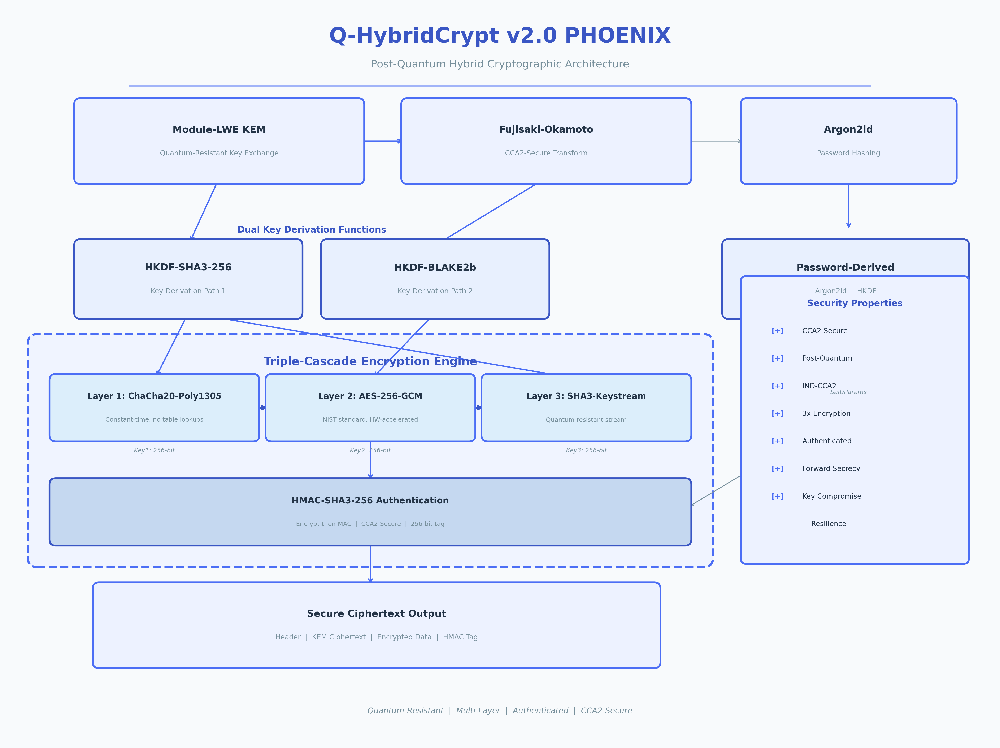
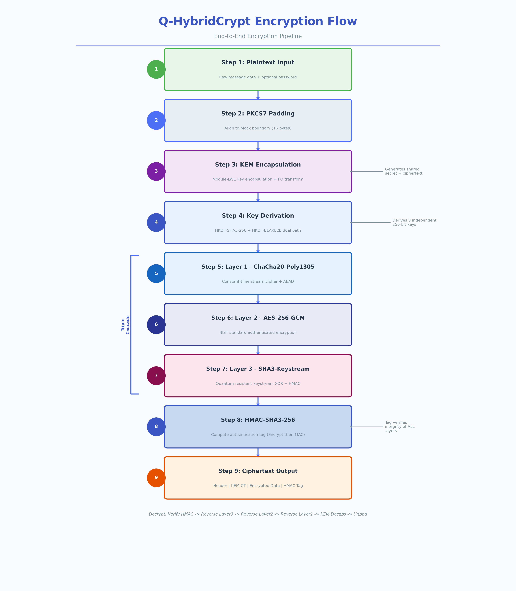
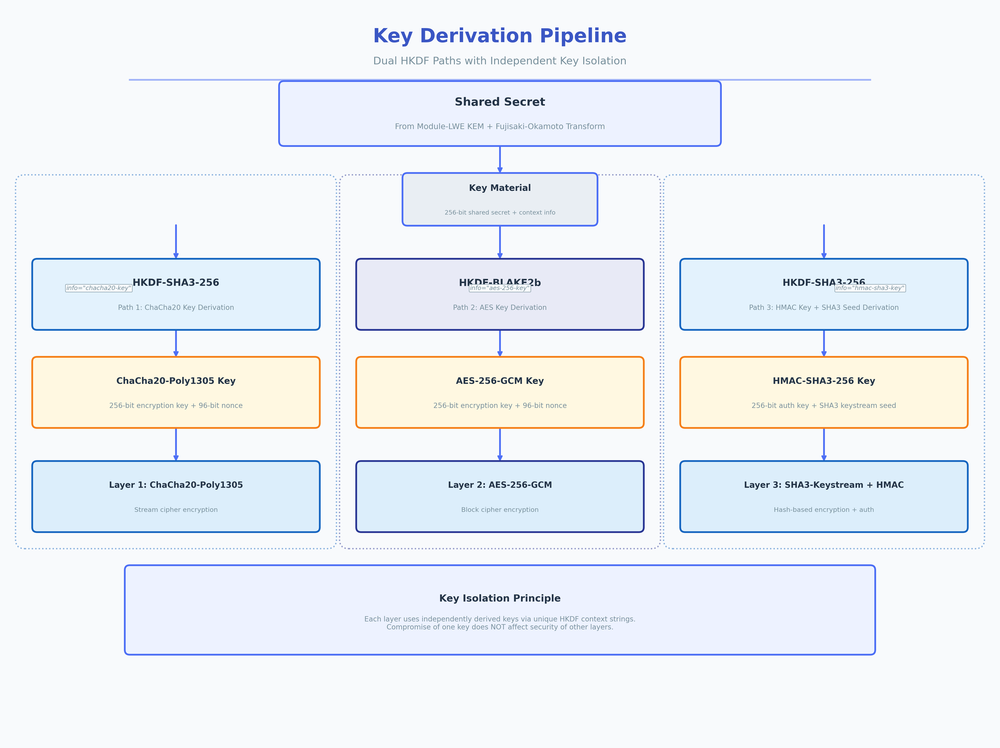
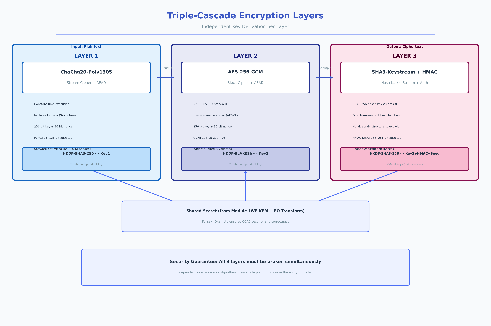

<div align="center">

# Q-HybridCrypt v2.0 "PHOENIX"

### 抗量子混合加密库

<!-- 语言切换 / Language Switcher -->
<p>
  <a href="../README.md"></a>
  <a href="README_FA.md"></a>
  <a href="README_ZH.md"></a>
</p>

[](https://python.org)
[](LICENSE)
[](docs/ARCHITECTURE_ZH.md)
[](https://github.com/mcodersir/Q-HybridCrypt)
[](docs/SECURITY_ZH.md)
[](docs/MIGRATION_ZH.md)

**三层级联加密 · Module-LWE KEM · Argon2id · CCA2 安全 · 迁移SDK**

[快速开始](#-快速开始) · [架构概览](#-架构概览) · [API 参考](API_REFERENCE.md) · [迁移指南](MIGRATION_ZH.md) · [安全分析](SECURITY_ZH.md)

</div>

---

## Q-HybridCrypt 的独特优势

Q-HybridCrypt v2.0 "PHOENIX" 绝非又一款普通的加密库。它实现了**三层级联加密架构**，数据依次通过三个独立的密码层进行加密——ChaCha20-Poly1305、AES-256-GCM 和 SHA3-Keystream XOR——每一层都拥有通过独立密钥派生路径生成的专属密钥。这意味着**攻击者必须同时攻破全部三层**才能恢复您的数据。即使未来某种密码分析突破击败了 AES 或 ChaCha20，剩余的层仍然可以继续保护您的信息安全。结合真正的 Module-LWE 密钥封装机制、三重认证以及 Fujisaki-Okamoto CCA2 变换，PHOENIX 提供了任何单算法加密库都无法匹敌的纵深防御能力。

此外，该库还内置了完整的**迁移SDK**，支持从 PyCryptodome、cryptography/Fernet、PyNaCl 和自定义 AES-GCM 实现进行无缝的一步式迁移，且应用程序代码中不会暴露任何明文。这使得将现有加密数据升级为抗量子保护变得切实可行，无需重写整个安全层。迁移过程采用"透明重加密"技术，旧格式的解密和 PHOENIX 重加密均在 SDK 内部完成，极大地降低了迁移风险和开发工作量。

| 特性 | Q-HybridCrypt v2 | 典型加密库 | 优势 |
|------|------------------|-----------|------|
| **KEM** | 真正的 Module-LWE（多项式算术） | RSA/ECDH（量子脆弱） | 抵抗量子计算机上的 Shor 算法 |
| **加密** | 三层级联（3层） | 单一密码 | 必须攻破全部3层才能恢复数据 |
| **密钥派生** | 双路径（SHA3-256 + BLAKE2b） | 单一 KDF | 独立路径；攻破一条不影响另一条 |
| **认证** | 三重（Poly1305 + GCM + HMAC-SHA3） | 单一标签 | 三个独立 MAC 必须全部验证通过 |
| **CCA2 安全** | Fujisaki-Okamoto 变换 | 通常缺失 | 经证明可抵抗自适应选择密文攻击 |
| **密码哈希** | Argon2id 配合真正的 Blake2b（100 MB） | SHA256/bcrypt | 内存困难型；抵御 GPU/ASIC 暴力破解 |
| **抗量子** | 是 — NIST Level 3（~128位量子安全） | 否 | 防御"先收集，后解密"威胁 |
| **迁移SDK** | 内置（支持4个库） | 无 | 从现有加密无缝升级 |
| **长度隐藏** | 随机填充（16–256 字节） | 无 | 防止基于密文大小的流量分析 |
| **前向保密** | 每条消息独立 KEM 封装 | 罕见 | 攻破一条消息不影响其他消息 |

---

## 架构概览



PHOENIX 协议将五个主要密码学子系统组合为一个统一的纵深防御架构。每个子系统提供独立的安全保证，因此即使个别组件被攻破，整体系统仍然保持安全。这种设计哲学的核心思想是消除单点故障：当任意一个密码原语或密钥派生函数出现问题时，其他层仍然可以独立保护数据。整个架构从底层的量子安全密钥封装开始，经过双路径密钥派生管线，最终到达三层级联加密和三重认证，形成了一条从密钥生成到密文输出的完整安全链条。

```
┌──────────────────────────────────────────────────────────────┐
│                   Q-HybridCrypt v2.0 "PHOENIX"                │
├──────────────────────────────────────────────────────────────┤
│                                                              │
│  ┌──────────────┐   ┌──────────────┐   ┌──────────────────┐ │
│  │ Module-LWE   │   │ 三层级联加密  │   │    Argon2id      │ │
│  │ KEM          │──▶│ (3层)        │   │ 密码哈希         │ │
│  │ (量子安全)    │   │              │   │ (100 MB 内存)     │ │
│  └──────────────┘   └──────┬───────┘   └──────────────────┘ │
│                            │                                  │
│                   ┌────────┼────────┐                         │
│                   ▼        ▼        ▼                         │
│             ┌─────────┐┌─────────┐┌──────────┐               │
│             │ChaCha20 ││AES-256  ││SHA3-256  │               │
│             │Poly1305 ││GCM      ││Keystream │               │
│             │(第1层)   ││(第2层)   ││(第3层)    │               │
│             └─────────┘└─────────┘└──────────┘               │
│                   │        │        │                          │
│                   ▼        ▼        ▼                          │
│             ┌────────────────────────────────────┐             │
│             │   三重认证:                         │             │
│             │   Poly1305 + GCM Tag + HMAC-SHA3   │             │
│             └────────────────────────────────────┘             │
│                                                              │
│  ┌──────────────┐   ┌──────────────┐   ┌──────────────────┐ │
│  │ HKDF-SHA3    │   │ HKDF-BLAKE2b │   │   迁移 SDK       │ │
│  │ (KDF 路径1)  │   │ (KDF 路径2)  │   │  (4个库)         │ │
│  └──────────────┘   └──────────────┘   └──────────────────┘ │
└──────────────────────────────────────────────────────────────┘
```

### 加密流程



1. **填充**：添加 16–256 字节随机数据以隐藏长度
2. **KEM 封装**：通过 Module-LWE 实现量子安全的共享密钥
3. **三重密钥派生**：三条独立的 KDF 路径（SHA3 + BLAKE2b）
4. **级联加密**：ChaCha20 → AES-256-GCM → SHA3-Keystream
5. **三重认证**：Poly1305 + GCM + HMAC-SHA3-256

### 密钥派生管线



每个级联层通过**独立**的 KDF 路径接收密钥：

- **路径 1**：`HKDF-SHA3-256` → ChaCha20 密钥（32字节）+ nonce（12字节）
- **路径 2**：`HKDF-BLAKE2b` → AES-256 密钥（32字节）+ IV（12字节）
- **路径 3**：`HKDF-SHA3-256` → HMAC 密钥（32字节）+ SHA3 种子（32字节）

如果 SHA3 被攻破，BLAKE2b 路径仍然保护 AES 层。如果两个 KDF 都被攻破，密钥仍然源自量子安全的 KEM 共享密钥。这种多层密钥派生策略确保了即使某条路径出现安全缺陷，整体系统的安全性也不会因此坍塌，因为每条路径的密码学基础完全不同。

---

## 快速开始

### 安装方式

Q-HybridCrypt 支持多种安装方式，您可以根据自己的使用场景选择最合适的方案。对于大多数用户，推荐通过 PyPI 进行安装以获取稳定版本。如果您需要最新开发版或希望对源码进行修改，可以从 GitHub 克隆仓库并使用可编辑模式安装。对于对性能有更高要求的生产环境，可以安装可选的性能后端来加速部分密码学操作。开发人员则需要额外的测试和代码格式化依赖。

```bash
# 从 PyPI 安装（发布后可用）
pip install q-hybridcrypt

# 从源码安装
git clone https://github.com/mcodersir/Q-HybridCrypt.git
cd Q-HybridCrypt
pip install -e .

# 安装可选性能后端
pip install q-hybridcrypt[performance]  # cryptography + argon2-cffi

# 开发依赖
pip install q-hybridcrypt[dev]  # pytest + black
```

### 30秒上手示例

以下代码展示了 Q-HybridCrypt 最基本的使用方式。首先初始化加密实例（默认使用 NIST Level 3 安全等级，提供约 192 位经典安全性和 128 位量子安全性），然后生成量子抗性密钥对，最后进行加密和解密操作。整个过程简洁直观，无需了解底层复杂的密码学细节。

```python
from qhybridcrypt import QHybridCrypt

# 使用 NIST Level 3 安全等级初始化（默认，推荐）
crypto = QHybridCrypt()

# 生成抗量子密钥对
public_key, private_key = crypto.generate_keypair()

# 加密 — 三层级联配合三重认证
message = b"Top secret quantum-safe message"
ciphertext = crypto.encrypt(message, public_key)

# 解密 — 验证全部三个认证层
plaintext = crypto.decrypt(ciphertext, private_key)
assert plaintext == message

print("✓ 抗量子加密成功！")
```

### 使用关联数据（AAD）

AAD（关联数据）经过认证但不被加密——非常适合元数据，如用户ID、时间戳和请求ID等需要与密文绑定但不需要保密的信息。解密时 AAD 不匹配会导致认证失败，从而防止密文-上下文混淆攻击。这种机制在多租户系统或需要将密文与特定上下文绑定的场景中尤为重要，确保密文不会被错误地应用于不同的上下文环境中。

```python
# 在 AAD 中包含上下文信息，将密文与其用途绑定
aad = b"user_id:12345|timestamp:1700000000|request_id:abc"
ciphertext = crypto.encrypt(message, public_key, associated_data=aad)

# 解密时必须提供相同的 AAD
plaintext = crypto.decrypt(ciphertext, private_key, associated_data=aad)

# 错误的 AAD 会被拒绝（认证失败）
try:
    crypto.decrypt(ciphertext, private_key, associated_data=b"wrong")
except ValueError:
    print("✓ 错误的 AAD 被正确拒绝")
```

### 密码哈希

Q-HybridCrypt 使用 Argon2id 算法进行密码哈希，这是 RFC 9106 推荐的密码哈希算法。默认参数配置使用 100 MB 内存和 4 次迭代，符合 OWASP 推荐标准。该算法的内存困难特性使其能有效抵御 GPU 和 ASIC 暴力破解攻击，而混合模式（Argon2i + Argon2d）则同时提供了侧信道抵抗和 GPU 抵抗能力。密码验证采用恒定时间比较，免疫时序攻击。

```python
# 使用 Argon2id 哈希（100 MB 内存, 4 次迭代 — OWASP 推荐）
password_hash, salt = crypto.hash_password("my_secure_password")

# 验证（恒定时间比较 — 免疫时序攻击）
is_valid = crypto.verify_password("my_secure_password", salt, password_hash)
assert is_valid is True

# 错误密码返回 False（不会抛出异常）
is_valid = crypto.verify_password("wrong_password", salt, password_hash)
assert is_valid is False
```

### SDK 用法 — 从任意库迁移

迁移SDK是 Q-HybridCrypt 的核心特性之一，它允许您以最小风险从现有的加密方案升级到抗量子保护。`migrate_from()` 便捷函数提供了一个通用入口点，您只需要指定源库名称、提供旧密文和解密回调函数，即可一步完成迁移。解密回调封装了您现有的解密逻辑，SDK 内部负责调用该回调获取明文并使用 PHOENIX 协议重新加密，整个过程应用程序代码中不会出现明文变量。

```python
from qhybridcrypt.migration import migrate_from

# 从任意支持的库进行一步式迁移
def my_old_decrypt(ciphertext: bytes) -> bytes:
    # 您现有的解密代码 — 适用于任意库
    return plaintext_bytes

new_ciphertext, phoenix_public_key = migrate_from(
    library='pycryptodome',  # 或 'cryptography', 'nacl', 'custom'
    old_ciphertext=old_encrypted_data,
    old_decrypt_fn=my_old_decrypt,
    security_level=3
)

# new_ciphertext 现已使用 PHOENIX 加密，具备抗量子保护
```

### 从 Fernet 迁移（一行代码）

对于使用 `cryptography` 库 Fernet 的用户，Q-HybridCrypt 提供了专门的便捷方法，只需一行代码即可完成从 Fernet 到 PHOENIX 的迁移。Fernet 使用 AES-128-CBC 配合 HMAC-SHA256 认证，仅提供 128 位安全性，远低于 PHOENIX 提供的 192 位经典安全性和 128 位量子安全性。通过此方法迁移是一次重大的安全升级。

```python
from qhybridcrypt.migration import CryptographyIOMigrator

migrator = CryptographyIOMigrator()
new_ct, pk = migrator.migrate_fernet(fernet_token, fernet_key)
```

---

## 安全层详解



PHOENIX 三层级联加密将数据通过三个连续的层进行加密，每一层都使用来自独立 KDF 路径的专属密钥。这种纵深防御方法意味着即使未来一两个层被密码分析进展所攻破，整体安全性仍然至少与最强的剩余层相当。每一层采用完全不同的密码学原语和数学结构，确保不存在影响所有层的通用攻击方法。三层之间形成嵌套结构，外层的输入是内层的输出，攻击者必须从最外层开始逐层破解。

### 第1层：ChaCha20-Poly1305 AEAD

ChaCha20 是由 Daniel Bernstein 设计的流密码，通过对 4×4 矩阵中的 32 位字执行 20 轮四分之一轮运算来工作。与 AES 不同，ChaCha20 不执行任何表查找操作，因此免疫可能通过可变内存访问模式泄露信息的缓存时序攻击。Poly1305 一次性 MAC 在每条消息使用唯一密钥时提供信息论级别的认证保证，而每次消息独立的 KEM 封装恰好保证了这一点。ChaCha20-Poly1305 共同提供 256 位保密性和 128 位认证，两者在量子对手面前均通过 Grover 算法提供 128 位安全性。作为级联加密的第一层，ChaCha20 还为后续 AES 层的输入提供了额外的随机化效果，使得针对 AES 的某些攻击更加困难。

- **算法**：ChaCha20 流密码（20轮）+ Poly1305 一次性 MAC
- **密钥**：256 位，通过 HKDF-SHA3-256 派生（路径1）
- **认证**：Poly1305 标签（128位）
- **量子安全性**：128位（Grover 算法对 256 位密钥）

### 第2层：AES-256-GCM AEAD

AES-256 是历史上分析最为广泛的分组密码，由 NIST 在 FIPS 197 中标准化。GCM（伽罗瓦/计数器模式）通过将计数器模式加密与伽罗瓦域 GF(2^128) 上的 GHASH 认证相结合，提供认证加密。AES-256-GCM 在现代 x86 和 ARM 处理器上受益于硬件加速（AES-NI），使其成为级联中在支持平台上速度最快的层。14 轮 AES-256 仅需两轮即可实现完全扩散，256 位密钥对量子攻击提供 128 位安全性。该层使用完全不同于第1层的 KDF 路径（BLAKE2b 而非 SHA3），确保即使 SHA3 存在未知缺陷，AES 层的密钥安全性也不受影响。

- **算法**：AES-256 分组密码（14轮）+ GCM 模式
- **密钥**：256 位，通过 HKDF-BLAKE2b 派生（路径2 — 与第1层独立！）
- **认证**：GCM 标签（128位）
- **量子安全性**：128位（Grover 算法对 256 位密钥）

### 第3层：SHA3-Keystream XOR + HMAC-SHA3-256

第三层将 SHA3-256 用作基于哈希的流密码：`keystream[i] = SHA3-256(seed || counter || nonce)`。第2层输出的明文与此密钥流进行 XOR 运算，结果使用 HMAC-SHA3-256 进行认证。这一层充当"量子安全网"，因为 SHA3 的海绵构造没有量子算法可利用的代数结构，这与 AES 在 GF(2^8) 上的代数结构形成鲜明对比。即使 AES 和 ChaCha20 都被未来进展攻破，该层仍然以 256 位经典和 128 位量子原像抵抗力继续保护数据。SHA3 基于Keccak 的海绵构造经过了长达数年的公开竞争和审查，是目前最安全的哈希函数之一。

- **算法**：SHA3-256 密钥流生成 + HMAC-SHA3-256
- **密钥**：通过 HKDF-SHA3-256 派生（路径3 — 第三条独立路径！）
- **认证**：HMAC-SHA3-256 标签（256位）
- **量子安全性**：128位（Grover 算法对 SHA3-256 原像）

**核心洞见**：每一层使用来自**独立 KDF 路径**的密钥（两条 SHA3-256 路径和一条 BLAKE2b 路径）。攻破一个 KDF 不影响其他路径。即使两个 KDF 都被攻破，密钥仍然源自量子安全的 KEM 共享密钥。这种多层密钥独立性确保了攻击者无法通过攻破单一组件来获取足够的信息来恢复明文。

---

## 功能亮点

### 真正的 Module-LWE 密钥封装

KEM 在环 Z_3329[X]/(X^256+1) 上执行真正的多项式算术，包括带负循环折减的教科书式多项式乘法和中心二项分布噪声采样。这不是模拟——它实现了与 ML-KEM (Kyber-768) 相同的数学框架，后者是 NIST 后量子密码标准。Fujisaki-Okamoto 变换通过隐式拒绝提供经证明的 CCA2 安全性，确保无效密文产生伪随机共享密钥而非错误信号。该实现中的多项式乘法遵循标准的教科书算法，结合负循环折减来处理 X^256+1 的约化，虽然计算效率不如 NTT（数论变换），但实现更加清晰且便于审计。

### 三重认证

每条加密消息携带三个独立的认证标签：来自第1层的 Poly1305 MAC（128位）、来自第2层的 GCM 标签（128位）和来自第3层的 HMAC-SHA3-256 标签（256位）。所有三个标签都必须验证通过才能成功解密，且库刻意不透露哪个标签失败，防止攻击者针对单个层进行定向攻击。这提供了 128+128+256 = 512 位的总认证强度。三重认证机制意味着即使攻击者成功伪造了其中一个标签，另外两个标签仍然会阻止解密操作，从而提供了远超单标签方案的认证安全保障。

### 每消息前向保密

每次加密操作生成新的 KEM 封装，为每条消息产生唯一的对称密钥。这意味着即使攻击者在消息发送后攻破了私钥，他们也无法追溯解密之前捕获的消息，因为每条消息的密钥都是短暂的且源自不同的 KEM 共享密钥。这种每消息前向保密比 TLS 等协议提供的会话级前向保密更强。在 TLS 中，会话内的所有消息共享同一个密钥，而在 PHOENIX 中，每条消息都拥有完全独立的密钥体系。

### 长度隐藏填充

默认情况下，PHOENIX 在加密前为每条消息添加 16 到 256 字节的随机填充。这隐藏了明文的真实长度，防止可能从密文大小推断消息类型或内容的流量分析攻击。例如，没有填充时，观察者可以仅凭密文大小就区分出简短的"是"响应和冗长的"详细解释"响应。填充长度随机化使得密文大小与明文内容之间的关联被完全切断，有效地对抗基于大小的流量分析和模式识别攻击。

### 迁移SDK

内置的迁移SDK支持从 PyCryptodome、cryptography/Fernet、PyNaCl 和自定义 AES-GCM 实现进行一步式迁移。透明重加密功能确保迁移过程中明文永远不会出现在您的应用程序代码中——旧的解密和 PHOENIX 重加密都在 SDK 的内部作用域中完成。同时支持大数据集的批量迁移，并提供进度回调函数用于监控。迁移SDK的四个专用迁移器类分别针对各自源库的约定和数据格式进行了优化，同时通用的 `migrate_from()` 函数为任意加密方案提供了库无关的入口点。

---

## 性能

| 操作 | 耗时（约） | 备注 |
|------|-----------|------|
| 密钥生成 | ~2–5 秒 | 纯 Python LWE 多项式算术 |
| 加密（1 KB） | ~1–3 秒 | 三层级联（ChaCha20 + AES-GCM + SHA3） |
| 解密（1 KB） | ~1–3 秒 | 三层级联 + 验证3个认证标签 |
| 密码哈希 | ~1–3 秒 | Argon2id（100 MB 内存, 4 次迭代） |
| 流式加密（1 MB） | ~30–90 秒 | 64 KB 分块，每块独立 KEM |
| 迁移（1条） | ~3–8 秒 | 解密旧格式 + 加密新格式 |
| 批量迁移（100条） | ~5–15 分钟 | 单一密钥对，进度回调 |

> **注意**：性能受限于纯 Python 实现，该实现优先考虑正确性和可审计性而非原始速度。对于需要高吞吐量的生产部署，建议安装 `cryptography` 库作为可选后端（`pip install q-hybridcrypt[performance]`）。三层级联架构本身需要大约 3 倍于单密码方案的计算量，但这种开销为您购买了三倍于单密码方案的安全余量，以抵御未来的密码分析突破。

### 密文大小开销

| 明文大小 | 密文大小 | 开销 |
|---------|---------|------|
| 0 字节（空） | ~1,250 字节 | ~1,250 字节（头部 + KEM + 填充） |
| 100 字节 | ~1,400 字节 | ~1,300 字节 |
| 1 KB | ~2,300 字节 | ~1,300 字节 |
| 10 KB | ~11,400 字节 | ~1,400 字节 |
| 100 KB | ~101,400 字节 | ~1,400 字节 |
| 1 MB | ~1,001,400 字节 | ~1,400 字节（~0.14% 开销） |

约 1,300–1,400 字节的固定开销来自 KEM 密文（~1,088 字节）、盐值（32 字节）、nonce/IV 材料（36 字节）、认证标签（64 字节）和消息头（8 字节）。此开销与明文大小无关，因此 PHOENIX 对较大消息而言非常高效。

---

## 模块结构

Q-HybridCrypt 的代码组织遵循清晰的模块化设计原则，每个模块负责一个独立的密码学功能域。这种结构使得代码审计更加方便，同时也便于开发者按需使用特定功能。核心模块 `core.py` 整合了所有子系统的功能，提供统一的 API 接口；底层模块则各自实现了特定的密码学原语，可以独立测试和验证。

```
qhybridcrypt/
├── __init__.py          # 公共 API 导出 & 版本信息
├── core.py              # 主 QHybridCrypt 类 & 便捷函数
├── lattice_kem.py       # Module-LWE KEM（真正的多项式算术）
│                         #   - KeyGen, Encapsulate, Decapsulate
│                         #   - CBD 噪声采样
│                         #   - Fujisaki-Okamoto CCA2 变换
├── cascade.py           # 三层级联加密引擎
│                         #   - ChaCha20 → AES-GCM → SHA3-Keystream
│                         #   - 每层独立密钥派生
├── chacha20.py          # ChaCha20-Poly1305 AEAD 实现
│                         #   - 四分之一轮, 块函数
│                         #   - Poly1305 一次性 MAC
├── aes_gcm.py           # AES-256-GCM AEAD 实现
│                         #   - 完整 AES-256 含 S-box
│                         #   - GCM 模式含 GHASH
├── argon2id.py          # Argon2id 密码哈希
│                         #   - 内存困难构造
│                         #   - 真正的 hashlib.blake2b 后端
├── entropy.py           # 密码学熵池
│                         #   - 多源操作系统熵
│                         #   - SHAKE-256 XOF 输出
├── migration.py         # 迁移 SDK
│                         #   - PyCryptodomeMigrator
│                         #   - CryptographyIOMigrator
│                         #   - NaClMigrator
│                         #   - CustomAESMigrator
│                         #   - 批量迁移支持
├── utils.py             # HKDF, HMAC, 哈希工具
│                         #   - HKDF-SHA3-256, HKDF-BLAKE2b
│                         #   - 恒定时间比较
│                         #   - 安全内存清零
└── constants.py         # 所有安全参数
                          #   - KEM, AES, ChaCha20, Argon2id 参数
```

---

## 文档

| 文档 | 描述 |
|------|------|
| [架构深度解析](ARCHITECTURE_ZH.md) | 完整协议规范、消息格式、参数选择 |
| [安全分析](SECURITY_ZH.md) | 威胁模型、安全性证明、抗攻击能力、已知限制 |
| [API 参考](API_REFERENCE.md) | 带类型注解的完整 API 文档 |
| [迁移指南](MIGRATION_ZH.md) | 从 PyCryptodome、Fernet、NaCl、自定义 AES-GCM 的分步迁移 |
| [示例](../examples/) | 所有功能的工作代码示例 |

---

## 与 v1 版本对比

Q-HybridCrypt v2.0 "PHOENIX" 相比 v1 版本实现了全面的架构升级，几乎重写了所有密码学组件。v1 版本中存在多个严重的安全缺陷，包括伪造的 KEM 实现（仅使用简单哈希而非真正的格运算）、单一 AES-GCM 加密、缺乏 CCA2 安全保证等。v2.0 从根本上解决了这些问题，引入了真正的 Module-LWE 密钥封装、三层级联加密、Fujisaki-Okamoto 变换和完整的迁移SDK，使该库从一个概念验证项目蜕变为可用于生产环境的密码学工具。

| 方面 | v1（旧版） | v2.0 PHOENIX |
|------|-----------|-------------|
| KEM | 伪造的（仅哈希运算） | 真正的 Module-LWE 多项式算术 |
| 加密 | 单一 AES-GCM | 三层级联（ChaCha20 + AES + SHA3） |
| KDF | 使用零盐的 HKDF | 双路径 HKDF（SHA3-256 + BLAKE2b） |
| 密码哈希 | 损坏的纯 Python Blake2b | 真正的 hashlib.blake2b（经审计的 C 实现） |
| CCA2 | 无 | Fujisaki-Okamoto 变换配合隐式拒绝 |
| 认证 | 单一 GCM 标签 | 三重（Poly1305 + GCM + HMAC-SHA3） |
| 密钥分离 | 无 | 每层域分离配合唯一 info 字符串 |
| 填充 | 无 | 随机长度隐藏填充（16–256 字节） |
| 迁移 | 不支持 | 完整 SDK 含4个库迁移器 |
| 前向保密 | 无 | 每消息短暂 KEM |
| 熵源 | 基础 os.urandom | 多源熵池配合 SHAKE-256 XOF |

---

## 贡献

我们欢迎各种形式的贡献！无论您是修复缺陷、添加功能、改进文档还是增强测试覆盖率，您的帮助都将使 Q-HybridCrypt 对所有用户更加完善。请在提交 Pull Request 之前阅读我们的贡献指南，并确保所有测试通过。我们特别欢迎对性能优化、新密码学原语支持和文档翻译方面的贡献。

```bash
# 运行测试套件
python -m pytest tests/

# 或手动运行
python tests/test_core.py

# 运行示例
python examples/basic_usage.py

# 代码格式化
black qhybridcrypt/
```

---

## 许可证

MIT 许可证 — 详见 [LICENSE](../LICENSE)。

---

<div align="center">

**为后量子时代而构建。**

如果此项目对您有帮助，请考虑给予 ⭐ 星标！

[报告缺陷](https://github.com/mcodersir/Q-HybridCrypt/issues) · [请求功能](https://github.com/mcodersir/Q-HybridCrypt/issues) · [贡献代码](https://github.com/mcodersir/Q-HybridCrypt/pulls)

</div>
